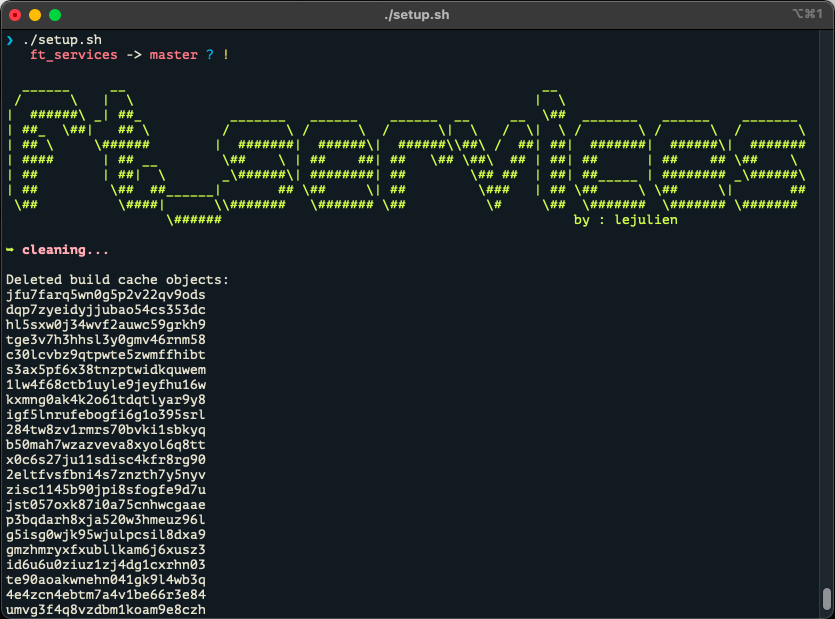

<h1 align="center">Services</h1>
<h3 align="center">A kubernetes cluster</h3>

 - Little preview

<h6>  Installation :</h6>

./setup.sh

<h6>  Services :</h6>

   - nginx

   - wordpress

   - mysql

   - grafana

   - influxdb

   - mariadb

   - phpmyadmin

- 🌱 Made at 42

